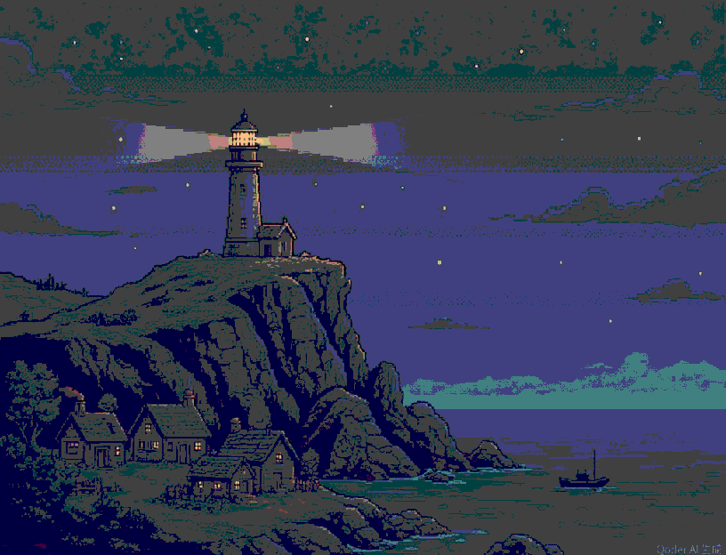

# rpgmaker-mcp

**Give your AI agent eyes inside RPG Maker MZ.** An MCP server that renders your
maps to real images, edits them cell by cell while you watch, writes event logic
in named commands instead of magic numbers, and then boots the actual game to
prove it works.


*`永宁镇 · 青瓦水乡` (map #6, 44×32): a two-cell-thick city wall with a south
gate, three roof/wall material pairs, a stone plaza with statues and pillars, a
canal crossed by three bridges, a lotus pond and a market stall. Built
cell-by-cell through this server's tools; the image is `render_map` output at
scale 1, composited from the project's own tileset PNGs — autotiles, wall
shadows, z-order and event sprites included.*


*The same build as a live session: the agent narrates each tool batch on the
left; the observation console on the right shows map #6 at step 9 of 9 — nine
`paint` steps with their cell counts (1,408 + 429 + 335 + …), pause /
single-step / replay controls and a per-cell inspector.*

[中文文档 →](README.zh-CN.md)

---

## Why this exists

RPG Maker MZ stores an entire game as JSON under `data/`. That is great for
tooling and terrible for agents: a map is a flat array of thousands of integers,
autotiles are shape numbers, and event scripts are numeric opcodes. Editing that
by text is a guessing game, and the agent never finds out it built a wall with no
door until a human opens the editor.

This server closes the loop:

```
data/Map006.json ──► paint / events / step editor ──► composited PNG preview
img/tilesets/*        (your project's own tiles)         (browser, 127.0.0.1)
data/System.json ──► event_* builders (named MZ codes) ──► real playtest
```

Every write is validated, every render is faithful to the engine's own tile
rules, and every claim below is reproducible with a command in this repo.

## What you get

### 1. The agent sees the map, not the numbers

- `render_map` composites your project's **own tileset PNGs** into a map image —
  autotile adjacency, wall shadows, z-order and events included. Crop a region,
  scale it, overlay a coordinate grid, event markers or the region layer.
- `tileset_catalog` reports which Tileset mode a map uses and which image file
  actually sits in each A1–A5 / B–E slot, so the agent never assumes a palette.
- `tile_palette` shows what a sheet looks like with its tile ids; `tile_info`
  probes one id for its sheet, autotile role, the paired A4 wall-top/wall-side
  bases, and warns when a B–E tile is one corner of a 2×2 / 3×3 composite.
- `inspect_cell` returns all six layers of one cell (4 visual + shadow + region).

### 2. Editing you can watch, one cell at a time

- `open_editor` starts a step session; `putground`, `put_event`, `move_event`,
  `set_event_image` each save and push an exact diff to the observer, which draws
  it and acknowledges. Pause, single-step, speed selection and replay of the last
  session are built into the console.
- Batch tools (`paint_tiles`, `place_building`, `stamp_region`) do rectangles,
  building footprints with roof/wall pairing, and cross-map region copies.
- Mistakes are cheap: SHA-256 revision checks on every write, a cross-process
  writer lock, a backup before each change, and `edit_history` / `undo_map_edit`.

### 3. Wall shadows that match the editor

Autotile walls cast shadows in MZ through layer 4 bit masks, and getting them
wrong produces the classic "striped wall" bug. `paint_tiles` runs an
**editor-parity shadow reconcile** by default (`autoShadow`): wall bodies stay
`0`, the first ground cell right of a wall gets `5`, stale masks are reclaimed
when their wall is removed, hand-painted masks are left alone, and the result
reports `shadowCells`. Writes that would fight the reconcile are refused instead
of silently dropped.

### 4. Event logic as named commands — 46 of them

`event_show_text`, `event_show_choices`, `event_battle`, `event_give_items`,
`event_if`, `event_switches`, `event_move_route`, `event_transfer_player`,
`event_screen_fade`, `event_set_weather`, `event_shop`, `event_play_se` … each
one appends real MZ command codes to an event page in a single transaction, with
parameters validated against the engine's `Game_Interpreter` layout (including
the MV↔MZ differences: Play SE is **250**, Play ME is **249**, choices take five
parameters). Anything not covered falls through to `event_raw_commands`.

### 5. Playtest for real, without touching your project

- `playtest_start` runs the **full game** in a local browser through
  `plugin/MZVisualBridge.js`, injected via the test HTTP response — your
  project's plugin list is not modified. Then `runtime_control`
  (start / move / interact / input / teleport / reload), `runtime_capture` for
  screenshots, `runtime_status` for switches, variables and self-switches.
- `native_playtest_start` does the same in a private copy of the licensed NW.js
  runtime on Windows (~320 MB, copied once, verified, isolated config dir).
- The browser channel blocks external network and WebSocket traffic.

### 6. Nothing proprietary ships here

The repo contains only original code. No RPG Maker core scripts, tiles,
characters, music, fonts, NW.js binaries, demo projects or runtime tokens. The
renderer reads your installation at runtime; the server binds its observer and
playtest endpoints to `127.0.0.1` with a private token.

## The 78 tools

| Group | Tools |
| --- | --- |
| Project | `project_info`, `list_maps`, `read_map`, `create_map`, `configure_map` |
| Observation | `render_map`, `tileset_catalog`, `tile_palette`, `tile_info`, `inspect_cell`, `preview_focus` |
| Map painting | `paint_tiles`, `place_building`, `stamp_region` |
| Events | `upsert_event`, `delete_event` |
| Event logic (46) | `event_show_text`, `event_show_choices`, `event_input_number`, `event_battle`, `event_give_gold`, `event_give_items`, `event_switches`, `event_self_switch`, `event_variables`, `event_if`, `event_move_route`, `event_play_se`, `event_transfer_player`, `event_wait`, `event_change_party`, `event_change_actor_hp` / `_mp` / `_level` / `_state` / `_skill` / `_images`, `event_recover_all`, `event_change_enemy_hp`, `event_enemy_appear`, `event_enemy_transform`, `event_screen_fade`, `event_tint_screen`, `event_flash_screen`, `event_shake_screen`, `event_set_weather`, `event_show_animation`, `event_set_event_location`, `event_show_picture`, `event_move_picture`, `event_erase_picture`, `event_comment`, `event_exit_event`, `event_call_common_event`, `event_label`, `event_jump_to_label`, `event_name_input`, `event_shop`, `event_control_timer`, `event_change_access`, `event_erase_event`, `event_raw_commands` |
| Step editor | `open_editor`, `putground`, `put_event`, `move_event`, `set_event_image`, `close_editor` |
| Verify / undo | `analyze_map`, `edit_history`, `undo_map_edit` |
| Playtest | `playtest_start`, `playtest_stop`, `native_playtest_start`, `native_playtest_stop`, `runtime_status`, `runtime_capture`, `runtime_control` |

Full parameter tables: [`docs/TOOLS.md`](docs/TOOLS.md).

## Quick start

Requirements: **Node.js 20+**, an RPG Maker MZ project folder (the one with
`data/`, `img/`, `js/`), and a locally installed Edge / Chrome / Chromium. No
build step, no browser download.

```sh
git clone https://github.com/twrsm666/rpgmaker-mcp
cd rpgmaker-mcp
npm ci
node src/server.js --project "/absolute/path/to/your-mz-project" --engine "/absolute/path/to/RPG Maker MZ"
```

`--project` is the game project (contains `data/System.json`), not the engine
install. If the project already has `js/rmmz_core.js`, design previews work
without `--engine`. Browser auto-detection covers Windows, common Linux paths
and macOS Chrome; override with `--browser` or `RPG_MCP_BROWSER`.

| Flag | Effect |
| --- | --- |
| `--project` | MZ project directory (required) |
| `--engine` | local MZ installation directory |
| `--browser` | Chromium-family executable to render with |
| `--port` | observer port (default: random) |
| `--read-only` | refuse map file writes |
| `--preview-only` | observer only, no stdio MCP |
| `--live-bridge` | enable playtest channel and runtime tools |

### MCP client configuration

Copy and adapt [`examples/mcp-config.example.json`](examples/mcp-config.example.json):

```json
{
  "mcpServers": {
    "rpg-maker-mz": {
      "command": "node",
      "args": [
        "/absolute/path/to/rpgmaker-mcp/src/server.js",
        "--project", "/absolute/path/to/your-project",
        "--engine", "/absolute/path/to/RPG Maker MZ",
        "--live-bridge"
      ]
    }
  }
}
```

`project_info` / `preview_focus` return the observer URL with its private token;
the same URL is printed to stderr (stdout carries only MCP JSON-RPC). Keep those
out of public repos.

## Editing, in practice

Visual writes carry an `expectedSheet` assertion so a tile id can never land on
the wrong sheet (`tileId: 0` clears a cell and takes no sheet):

```json
{"mapId": 6, "expectedRevision": "<latest>", "rectangles": [
  {"x": 5, "y": 20, "w": 30, "h": 2, "layer": 0, "tileId": 2336, "expectedSheet": "A1"}
]}
```

A step session, one call per visible step:

```js
const editor = await visualEditor(mcpClient, 6, { holdMs: 300 });
await editor.putground(10, 8, 0, 2816, "Meadow ground", "A2");
await editor.put_event({ x: 12, y: 8, name: "Guide", text: "Welcome.",
  image: { characterName: "People1", characterIndex: 0 } });
await editor.move_event(1, 13, 8);
await editor.close();
```

Coordinates are zero-based. Layers 0–3 are MZ's visual stack (not
"ground/interior/dungeon" categories); layer 4 is the shadow mask and layer 5 the
region id. `presentation.status=rendered` means the browser confirmed drawing
that revision; `no_observer` / `pending_or_paused` mean it did not, and saved
data is never rolled back.

Event logic stacks the same way — build the event, then append behaviour:

```json
{"mapId": 6, "expectedRevision": "<latest>", "eventId": 7,
 "condition": {"type": "gold", "amount": 500, "test": ">="},
 "thenCommands": [{"code": 101, "parameters": ["", 0, 0, 2, ""]},
                  {"code": 401, "parameters": ["You are rich!"]}]}
```

## Gallery

The two images at the top of this page are from one real 0.5.0 session. For
reference, this is what the previous TypeScript renderer produced — kept so the
two lines can be compared:



## Testing

No engine or copyrighted assets needed:

```sh
npm ci
npm run check     # source-level invariants
npm test          # node --test, 57 pass without an engine
npm run audit:release
```

GitHub Actions runs `check` + `test` on Node 20/22, Windows and Linux. With a
licensed MZ install, the full suites unlock:

```powershell
$env:RPG_MCP_ENGINE = "D:\Tools\RPG Maker MZ"
npm run demo -- --engine "$env:RPG_MCP_ENGINE"
npm run verify          # stdio tools end to end
npm run verify:ui       # observer UI
npm run verify:steps    # step editor / pause / replay
npm run verify:runtime  # browser playtest
npm run verify:nw       # native NW.js playtest
```

Everything runs against throwaway copies under `.work/`; screenshots and reports
land in `verification/`. Both are gitignored.

## Known boundaries

1. **The native MZ editor does not share memory.** Save and close the editor
   before MCP writes; reopen afterwards.
2. The design canvas does not run plugins or event logic — lighting, custom
   drawing, real passability and battles are verified in the playtest.
3. There is no "upload a script, auto-clear the game, get a report" tool; the
   runtime input/move tools are primitives you orchestrate.
4. Step replay lives in the current server process only.
5. Encrypted assets are unsupported; validated baseline is MZ 1.8.x on Windows
   with local browser rendering.
6. Static passability analysis is approximate — playtest for truth.
7. One server per project; separate servers share only the on-disk write lock.

## Documentation

- [`docs/TOOLS.md`](docs/TOOLS.md) — every tool, its inputs and its guarantees.
- [`docs/VALIDATION.md`](docs/VALIDATION.md) — what was measured on which build.
- [`docs/TROUBLESHOOTING.md`](docs/TROUBLESHOOTING.md) — the 37-item field log of
  MZ automation traps (headless focus gating, autotile shapes, ★ passability,
  MV↔MZ opcode differences, NW.js exit codes…). Hard-won, all reproduced.
- [`docs/tool-defects.md`](docs/tool-defects.md) — the honest ledger of known
  open defects.
- [`docs/legacy-0.4.2/`](docs/legacy-0.4.2/) — the previous TypeScript line:
  README, changelog, acceptance runbook, review response, release checklist.

## License

MIT for the code in this repository only — see [`LICENSE`](LICENSE) and
[`THIRD_PARTY_NOTICES.md`](THIRD_PARTY_NOTICES.md). Third-party dependencies and
all RPG Maker files keep their own licenses. This project is not affiliated with
or endorsed by RPG Maker / Gotcha Gotcha Games / Kadokawa.
