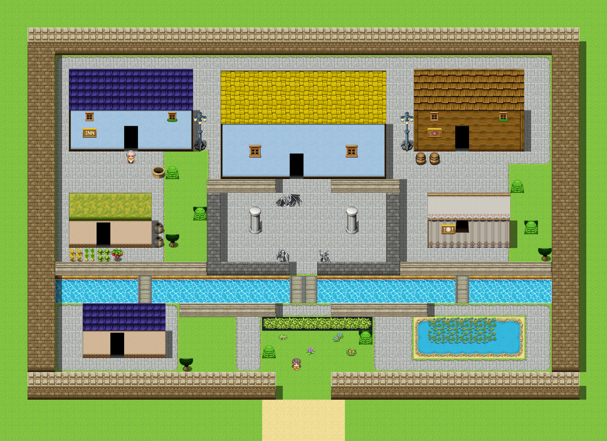
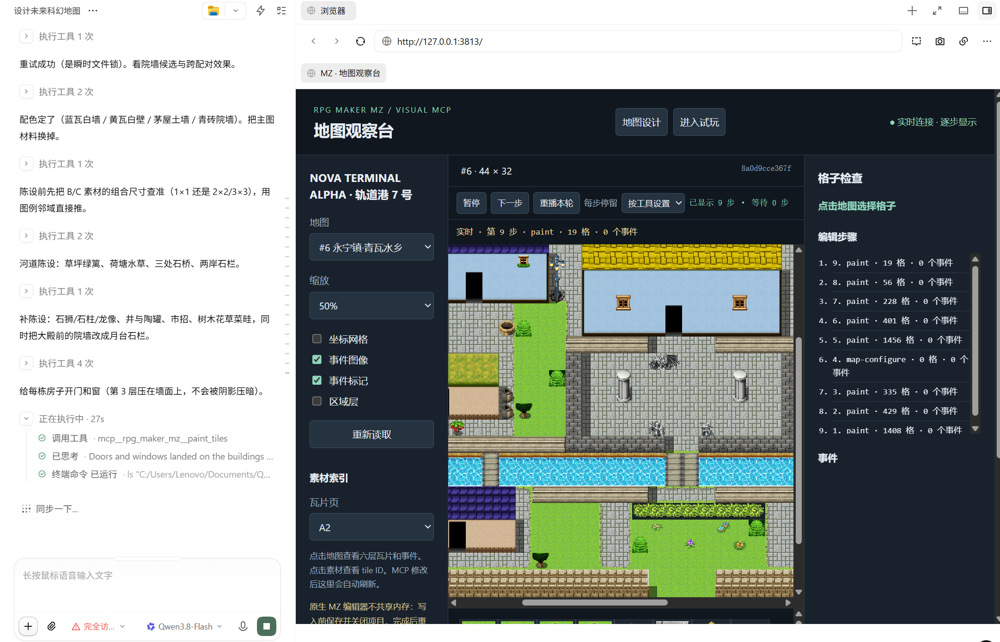

# rpgmaker-mcp（中文文档）

让 agent **看着地图编辑**，而不是仅靠猜测 JSON 布局。一个非官方、本地优先的
RPG Maker MZ 可视化 MCP 服务。



*「永宁镇·青瓦水乡」（地图 #6，44×32）：两格厚城墙带南门、三种屋顶/墙体配色、石狮石柱
广场、三座石桥跨河、荷塘与集市摊。全部由本服务的工具逐格建成；上图为 `render_map`
scale 1 输出，直接用项目自己的瓦片图合成——自动瓦片、墙影、z 序与事件精灵都包含在内。*



*一次真实会话：agent 设计 44×32 的中国风小镇「永宁镇·青瓦水乡」，观察台实时流式
绘制每个 `paint` 步骤（图中为第 9 / 9 步，各步 1408 / 429 / 335 … 格），带暂停、
单步、重播与逐格检查面板。*

当前版本：`0.5.0`。MCP 采用 **stdio**；地图观察台和游戏测试资源只监听
`127.0.0.1`。使用前需要自己的正版/合法许可 RPG Maker MZ 安装或完整项目，以及本机
已安装的 Edge / Chrome / Chromium。

仓库只包含自编代码。**不包含 RPG Maker 核心脚本、瓦片、角色、音乐、字体、NW.js、
演示工程或真实运行令牌。**

> 0.5.0 起本仓库的实现切换为视觉优先的 JavaScript 版本（78 个工具、浏览器渲染、
> 无需构建）。旧的 TypeScript 实现（0.1.x–0.4.2，65 个工具）的文档完整保留在
> [`docs/legacy-0.4.2/`](docs/legacy-0.4.2/)。

## 功能

- 地图 PNG、局部放大、坐标网格、六层检查、真实瓦片图册。
- 批量铺瓦片、自动瓦片邻接、建筑轮廓、跨地图区域复制。
- 地图创建、地图配置、事件页、对话、传送与事件删除。
- **事件逻辑一键布置**：`event_*` 工具直接向事件页追加 MZ 指令——战斗处理(301)、
  开关(121)、独立开关(123)、条件分支(111)、金钱(125)、物品/武器/防具(126/127/128)、
  变量(122)、移动路线(205，-1=玩家/0=本事件)、音效(SE 250 / ME 249 / BGM 241 /
  BGS 245)、传送(201)、等待(230)、显示选项(102)、输入数字(103)、入队/离队(129)、
  HP/MP/等级/状态/技能/头像(311/312/316/313/318/322)、全体回复(314)、敌方
  HP/出现/变身(331/335/336)、画面淡出淡入/色调/闪烁/摇晃/天气(221/222/223/224/225/236)、
  动画(212)、事件位置(203)、图片(231/232/235)、注释(108)、退出事件(115)、清除事件(214)、
  公共事件(117)、标签/跳转(118/119)、命名输入(303)、商店(302)、计时器(124)、
  权限(134/135/136/137)，另有原生指令码兜底 `event_raw_commands`。常见自动化坑
  （clamp 崩溃、输入注入、指令码重编号等）见
  [docs/TROUBLESHOOTING.md](docs/TROUBLESHOOTING.md)。
- **逐格编辑**：每步保存并实时显示；视觉层调用还需声明 `expectedSheet`，服务会校验
  tile ID 是否属于该素材页。
- 事件新增、移动和图像更新的逐步展示；暂停、单步、速度选择和本轮回放。
- SHA-256 版本检查、跨服务写锁、修改前备份、历史与撤销。
- 浏览器完整 MZ 试玩；可选 Windows 原生 NW.js 试玩。
- 真实游戏截图、移动、交互、输入、传送、开关和变量操作。

## 快速开始

需要 Node.js **20+**。本项目不下载浏览器，不需要构建。

```sh
npm ci
node src/server.js --project "/absolute/path/to/your-mz-project" --engine "/absolute/path/to/RPG Maker MZ"
```

Windows 示例：

```powershell
npm ci
node src/server.js --project "D:\Games\MyProject" --engine "D:\Tools\RPG Maker MZ"
```

`--project` 应指向包含 `data/System.json`、`data/Tilesets.json`、`data/MapInfos.json`
的游戏项目目录，不是引擎安装目录。

完整项目已经有 `js/rmmz_core.js` 时，设计预览可不传 `--engine`。默认浏览器检测支持
Windows、常见 Linux Chromium 路径和 macOS Chrome；其他路径用 `--browser` 或环境变量
`RPG_MCP_BROWSER`。

启动参数：

| 参数 | 作用 |
| --- | --- |
| `--project` | 绑定的 MZ 项目目录，必需 |
| `--engine` | 本地 MZ 安装目录 |
| `--browser` | 本地 Chromium 系浏览器可执行文件 |
| `--port` | 观察台端口；默认随机 |
| `--read-only` | 禁止地图文件写入 |
| `--preview-only` | 仅启动浏览器观察台，不连接 stdio MCP |
| `--live-bridge` | 启用游戏试玩通道与运行时工具 |

工具 `project_info` / `preview_focus` 返回带私有 token 的观察台地址。stderr 也会打印
地址，stdout 仅用于 MCP JSON-RPC。不要将 token 地址、项目连接文件或运行日志发布到仓库。

## MCP 客户端配置

复制并修改 [examples/mcp-config.example.json](examples/mcp-config.example.json)。示例
使用通用 `mcpServers` JSON；不同客户端的配置入口可能不同。

```json
{
  "mcpServers": {
    "rpg-maker-mz": {
      "command": "node",
      "args": [
        "/absolute/path/to/rpgmaker-mcp/src/server.js",
        "--project", "/absolute/path/to/your-project",
        "--engine", "/absolute/path/to/RPG Maker MZ",
        "--live-bridge"
      ]
    }
  }
}
```

## 逐格编辑：立即可见

先 `open_editor` 指定地图，再用返回的 `editorId` 提交单步工具：

```json
{"mapId": 1, "holdMs": 250, "awaitVisible": true}
```

```json
{"editorId": "<returned-id>", "x": 10, "y": 8, "high": 0, "num": 2816}
```

也可以使用 [bin/visual-editor.js](bin/visual-editor.js) 的四参数函数：

```js
const editor = await visualEditor(mcpClient, 1, { holdMs: 300 });
await editor.putground(10, 8, 0, 2816, "Place A2 ground", "A2");
await editor.putground(11, 8, 0, 2912, "Place A2 ground", "A2");
await editor.put_event({
  x: 12, y: 8, name: "向导", text: "欢迎来到小院。",
  image: { characterName: "People1", characterIndex: 0 }
});
await editor.move_event(1, 13, 8);
await editor.set_event_image(1, { direction: 4 });
await editor.close();
```

坐标从零开始。先调用 `tileset_catalog(mapId)` 查看地图实际使用的 Tileset 模式和
A1-A5/B-E 素材槽，再用 `tile_palette` 查看外观与 tile ID。`high=0..3` 是 MZ 的视觉
堆叠层，不代表“场地/内部/地牢”等素材类别；每个视觉图块调用都要声明 `expectedSheet`，
服务会检查它是否与 tile ID 的素材页匹配（`tileId: 0` 表示清空该格，0 不属于任何素材
页，此时必须省略 `expectedSheet`）。`high=4` 是阴影值 `0..15`，`high=5` 是 Region ID
`0..255`。阴影层由 `autoShadow`（默认开）按当前墙况双向对账，规则与编辑器手工画墙
一致：墙身自格保持 `0`，墙身右侧第一格非墙地面写 `5`（往墙身自格写掩码会让两格以上的
厚墙出现明暗相间竖条）。只有 `0/5/10` 会被自动改写，手绘掩码保持不变，改写的格数在
返回值的 `shadowCells` 中；与对账结果冲突的第 4 层写入会被直接拒绝，要自己支配阴影层
就传 `autoShadow: false`。自动瓦片拼接可能同时调整邻格的形状编号。`stamp_region`
只允许在使用相同 Tileset 的地图间复制原始 tile ID。

每次单格工具执行流程：

```text
校验版本 → 保存单格/事件 → 推送精确差量 → 浏览器按序绘制 → 停留 → 返回绘制确认
```

`presentation.status=rendered` 表示浏览器确认绘制了该版本，不代表用户一定亲眼看见。
浏览器离线返回 `no_observer`；暂停/超时返回 `pending_or_paused`。两种情况下已保存的
数据不会回滚。一次会话最多记录 3,000 步，刷新后可从服务读取最后一轮回放；重启服务后
记录不保留。

其他批量工具也会立即推送差量，但一次批量调用仍是一帧。需要展示“一格一格”的过程时，
逐次 `await putground(...)`，不要一次提交整个矩形。

## 事件逻辑：一次一个函数

先用 `upsert_event` 建事件，再向它追加行为。每个 `event_*` 工具都是一次事务提交
（备份、版本检查、差量推送、截图），指令默认插到事件页末尾，页尾的 code 0 结束符自动
维护（`insertAt` 可指定插入位置）：

```json
{"mapId": 4, "expectedRevision": "<最新版本>", "eventId": 7, "troopId": 1,
 "canLose": true, "onWin": [{"code": 126, "parameters": [1, 0, 0, 1]}]}
```

```json
{"mapId": 4, "expectedRevision": "<最新版本>", "eventId": 7, "switchId": 2, "on": true}
```

```json
{"mapId": 4, "expectedRevision": "<最新版本>", "eventId": 7,
 "condition": {"type": "gold", "amount": 500, "test": ">="},
 "thenCommands": [{"code": 101, "parameters": ["", 0, 0, 2, ""]}, {"code": 401, "parameters": ["你很富有！"]}]}
```

典型剧情链：`event_show_text` → `event_show_choices` → `event_play_se` → `event_battle`
（胜负分支）→ `event_give_gold` / `event_give_items` → `event_change_actor_hp` /
`event_recover_all` → `event_switches` / `event_self_switch` → `event_if` →
`event_move_route` → `event_transfer_player` / `event_screen_fade`。复杂流程按顺序多次
调用即可组合；MZ 数据中开关编码 0 = ON、1 = OFF，工具入参直接使用布尔值。指令码与参数
顺序已对照本地 MZ 1.8.x 引擎源码核对——注意 MZ 中 Play SE 是 **250**、Play ME 是
**249**，与 MV 相反；102 显示选项是 5 参数（含 defaultType）；134/135/136/137 是
存档/菜单/遇敌/编成权限（MV 是 141–143）。`event_*` 未覆盖的指令（如脚本 355/655、
405 滚动文字）用 `event_raw_commands` 写原生指令码。

## 工具概览

详见 [docs/TOOLS.md](docs/TOOLS.md)：

- 项目：`project_info`、`list_maps`、`read_map`、`create_map`、`configure_map`。
- 观察：`render_map`、`tileset_catalog`、`tile_palette`、`tile_info`、`inspect_cell`、`preview_focus`。
- 地图：`paint_tiles`、`place_building`、`stamp_region`。
- 事件：`upsert_event`、`delete_event`。
- 事件逻辑：`event_show_text`、`event_show_choices`、`event_input_number`、`event_battle`、`event_give_gold`、`event_give_items`、`event_switches`、`event_self_switch`、`event_variables`、`event_if`、`event_move_route`、`event_play_se`、`event_transfer_player`、`event_wait`、`event_change_party`、`event_change_actor_hp/mp/level/state/skill/images`、`event_recover_all`、`event_change_enemy_hp`、`event_enemy_appear`、`event_enemy_transform`、`event_screen_fade`、`event_tint_screen`、`event_flash_screen`、`event_shake_screen`、`event_set_weather`、`event_show_animation`、`event_set_event_location`、`event_show_picture`、`event_move_picture`、`event_erase_picture`、`event_comment`、`event_exit_event`、`event_call_common_event`、`event_label`、`event_jump_to_label`、`event_name_input`、`event_shop`、`event_control_timer`、`event_change_access`、`event_erase_event`、`event_raw_commands`。
- 逐步编辑：`open_editor`、`putground`、`put_event`、`move_event`、`set_event_image`、`close_editor`。
- 验证/恢复：`analyze_map`、`edit_history`、`undo_map_edit`。
- 试玩：`playtest_start`、`playtest_stop`、`native_playtest_start`、`native_playtest_stop`、`runtime_status`、`runtime_capture`、`runtime_control`。

非会话写工具需要 `expectedRevision`（地图文件 SHA-256）；逐步会话自动保存最近版本，有
外部变更时仍拒绝覆盖。`upsert_event` 指定已有 ID 时替换完整事件；部分移动或改图请用
`move_event` / `set_event_image`。

## 真实游戏试玩

服务加 `--live-bridge` 后，`playtest_start` 在本机浏览器执行完整游戏。项目的桥接插件
在测试 HTTP 响应中加入，不改项目插件列表。游戏页执行项目脚本，浏览器自动化通道拦截
外部网络和 WebSocket；NW.js 通道不提供这种网络隔离。

Windows 原生测试需要启用项目桥接插件：

```powershell
node bin/install-bridge.js --project "D:\Games\MyProject" --engine "D:\Tools\RPG Maker MZ" --enable
```

旧插件与插件注册文件先备份到项目 `.rpg-mcp/`。自定义注册文件无法安全解析时，需要在 MZ
插件管理器手动启用。

调用 `native_playtest_start` 会首次将本地许可安装的 NW.js 复制到服务 `runtime/`
（约 320 MB），校验 `nw.exe`，使用独立配置目录。不会修改引擎原文件或安装目录权限。该
复制机制曾解决本地运行时带低完整性标签、无法创建 ProcessSingleton 的问题；不是所有
机器的退出码 21 都由同一原因引起。

运行时典型流程：

```text
playtest_start / native_playtest_start → sessionId
runtime_control(start_new_game)
runtime_control(teleport / move / interact / input)
runtime_capture
runtime_control(reload_map)  # 当前地图磁盘修改后重载
playtest_stop / native_playtest_stop
```

重载必须先结束当前事件/消息，且会重置地图事件运行状态。发布游戏前禁用开发桥接插件，
移除连接信息。

## 示例资产

- `examples/EnemyHpBars.js` — 前视战斗敌人血条（纯视觉插件示例）。
- `examples/audit-events.cjs` — 事件全面审计器：`node examples/audit-events.cjs <项目目录>`。
  检查行走图/脸图/图片/音频/动画文件是否存在、物品/武器/防具/技能/角色/敌群/传送目标
  引用是否有效，以及「设开关不翻页 → 无限重复触发」类逻辑漏洞（伤害型指令按方向区分，
  不误报）。

## 重要边界

1. **原生 MZ 编辑器不共享内存。**正式地图写入前保存并关闭原生项目；结束后重新打开。
   未保存编辑器状态和撤销栈没有接入 MCP。
2. 设计画布不执行插件/事件逻辑。灯光、自定义绘制、真实通行和战斗请在游戏运行时验证。
3. 当前没有“一次上传脚本，自动通关并给出报告”的工具；现有运行时输入与移动工具可以由
   调用端编排，但不是完整测试脚本 API。
4. 逐步回放只在当前服务进程内保存；断线时不能保证恢复所有尚未接收的实时帧，可重新读取
   地图。
5. 加密素材暂不支持；自定义插件兼容性未全面验证。已验证基线为 MZ 1.8.x / Windows，
   本地浏览器渲染。
6. 静态通行分析是近似，不代替实际试玩。超大地图使用分区渲染。
7. 同一项目建议一份服务；不同服务间只共享磁盘写锁，不共享实时回放队列。

## 测试

不需要引擎/版权素材：

```sh
npm ci
npm run check
npm test
npm run audit:release
```

纯单元测试运行，未配置 `RPG_MCP_ENGINE` 时本地集成测试显式跳过。GitHub Actions 对
Node.js 20/22、Windows/Linux 运行这一套。

拥有本地 MZ 许可安装后，可启用完整测试并自行生成临时 demo：

```powershell
$env:RPG_MCP_ENGINE = "D:\Tools\RPG Maker MZ"
npm run demo -- --engine "$env:RPG_MCP_ENGINE"
npm test
npm run verify
npm run verify:ui
npm run verify:steps
npm run verify:runtime
npm run verify:nw
```

测试在 `.work/` 的独立副本修改，不触及源项目；截图/报告输出到 `verification/`。这两类
目录都已 `.gitignore`。

## 发布到 GitHub

这个目录已经是源码仓库的根目录，解压后上传其内容即可。发布前执行测试并检查
`.gitignore`，不要提交 `runtime/`、`demo-project/`、`.work/`、`verification/`、
`node_modules/`、项目 `.rpg-mcp/` 或许可素材。

MIT 仅适用于本仓库的自编代码；第三方依赖和 RPG Maker 文件不重新授权。详见
[LICENSE](LICENSE) 与 [THIRD_PARTY_NOTICES.md](THIRD_PARTY_NOTICES.md)。本服务与
RPG Maker 官方无隶属关系。
